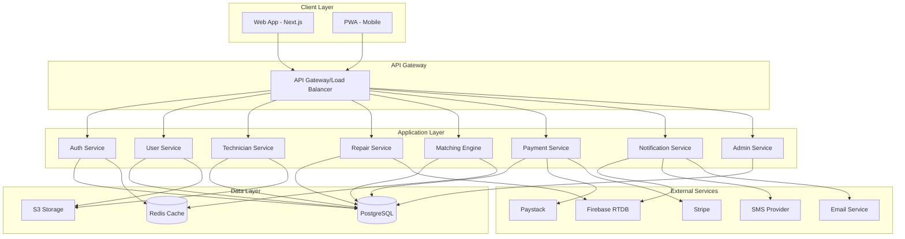

# Rev Platform - Architecture Overview

## System Architecture



## Technology Stack

### Frontend

- **Framework:** Next.js 14+ (App Router)
- **Styling:** TailwindCSS
- **State Management:** React Context + SWR/React Query
- **UI Components:** Custom components based on design system
- **PWA:** next-pwa for offline support
- **Real-time:** Firebase SDK for messaging

### Backend

- **Framework:** NestJS (TypeScript)
- **API:** RESTful + WebSocket for real-time
- **Authentication:** JWT with refresh tokens
- **Validation:** class-validator, class-transformer
- **ORM:** Prisma or TypeORM
- **Documentation:** Swagger/OpenAPI

### Database

- **Primary:** PostgreSQL 14+
  - User accounts
  - Technician profiles
  - Repair requests
  - Transactions
  - Reviews & ratings
- **Cache:** Redis
  - Session storage
  - Rate limiting
  - Matching cache
- **Real-time:** Firebase Realtime Database
  - In-app messaging
  - Live status updates

### Infrastructure

- **Hosting:** AWS or Vercel (frontend) + AWS (backend)
- **Storage:** AWS S3 (documents, images)
- **CDN:** CloudFront or Vercel Edge
- **Monitoring:** Sentry (errors) + PostHog (analytics)
- **CI/CD:** GitHub Actions

## Database Schema (High-Level)

### Core Tables

#### users

- id (UUID, PK)
- email (unique)
- phone (unique)
- password_hash
- role (enum: user, technician, admin)
- verified (boolean)
- created_at, updated_at

#### technician_profiles

- id (UUID, PK)
- user_id (FK → users)
- business_name
- specializations (JSON)
- location (geography)
- rating (decimal)
- verification_status (enum)
- documents (JSON)
- created_at, updated_at

#### repair_requests

- id (UUID, PK)
- user_id (FK → users)
- device_brand
- device_model
- issue_category
- issue_description
- location (geography)
- pickup_option (enum)
- preferred_time
- status (enum)
- created_at, updated_at

#### repair_jobs

- id (UUID, PK)
- repair_request_id (FK)
- technician_id (FK → technician_profiles)
- status (enum: pending, accepted, in_repair, ready, completed)
- estimated_cost
- actual_cost
- estimated_completion
- actual_completion
- created_at, updated_at

#### payments

- id (UUID, PK)
- repair_job_id (FK)
- amount
- payment_method (enum)
- payment_provider (enum)
- status (enum)
- transaction_id
- created_at, updated_at

#### reviews

- id (UUID, PK)
- repair_job_id (FK)
- user_id (FK)
- technician_id (FK)
- rating (1-5)
- comment
- created_at

## API Structure

### Authentication

- `POST /auth/register` - User registration
- `POST /auth/login` - User login
- `POST /auth/verify-otp` - OTP verification
- `POST /auth/refresh` - Refresh access token
- `POST /auth/logout` - Logout

### Users

- `GET /users/me` - Get current user
- `PUT /users/me` - Update profile
- `GET /users/:id` - Get user by ID

### Technicians

- `POST /technicians/register` - Technician registration
- `PUT /technicians/profile` - Update technician profile
- `POST /technicians/documents` - Upload verification documents
- `GET /technicians/:id` - Get technician profile

### Repairs

- `POST /repairs` - Create repair request
- `GET /repairs` - List user's repairs
- `GET /repairs/:id` - Get repair details
- `PUT /repairs/:id/cancel` - Cancel repair

### Jobs

- `GET /jobs` - List technician's jobs
- `PUT /jobs/:id/accept` - Accept job
- `PUT /jobs/:id/status` - Update job status
- `GET /jobs/:id` - Get job details

### Matching

- `POST /matching/find-technicians` - Find matching technicians
- `GET /matching/recommendations` - Get recommended technicians

### Payments

- `POST /payments/initialize` - Initialize payment
- `POST /payments/verify` - Verify payment
- `GET /payments/:id` - Get payment details

### Reviews

- `POST /reviews` - Submit review
- `GET /reviews/technician/:id` - Get technician reviews

### Admin

- `GET /admin/technicians/pending` - Get pending verifications
- `PUT /admin/technicians/:id/verify` - Verify technician
- `GET /admin/disputes` - List disputes
- `PUT /admin/disputes/:id/resolve` - Resolve dispute

## Security Considerations

1. **Authentication:** JWT with short-lived access tokens (15 min) and refresh tokens (7 days)
2. **Authorization:** Role-based access control (RBAC)
3. **Data Encryption:** SSL/TLS for data in transit, encryption at rest for sensitive data
4. **Rate Limiting:** Redis-based rate limiting on all endpoints
5. **Input Validation:** Strict validation on all inputs
6. **File Upload:** Virus scanning, file type validation, size limits
7. **Payment Security:** PCI compliance through Paystack/Stripe

## Matching Algorithm (MVP)

```typescript
interface MatchingCriteria {
  location: { lat: number; lng: number };
  deviceBrand: string;
  issueCategory: string;
  maxDistance: number; // default 10km
}

interface TechnicianScore {
  technicianId: string;
  score: number;
  rating: number;
  distance: number;
  responseTime: number;
}

function calculateScore(
  technician: Technician,
  userLocation: Location
): number {
  const ratingScore = technician.rating / 5; // normalize to 0-1
  const proximityScore = 1 - distance / maxDistance; // normalize to 0-1
  const responseScore = technician.avgResponseTime < 3600 ? 1 : 0.5;

  return 0.5 * ratingScore + 0.3 * proximityScore + 0.2 * responseScore;
}
```

## Deployment Strategy

### Environments

1. **Development:** Local development
2. **Staging:** Pre-production testing
3. **Production:** Live environment

### CI/CD Pipeline

1. Code push to GitHub
2. Run tests (unit, integration)
3. Build Docker images
4. Deploy to staging (auto)
5. Run E2E tests
6. Manual approval for production
7. Deploy to production
8. Health checks & monitoring

## Monitoring & Observability

- **Error Tracking:** Sentry
- **Analytics:** PostHog or Mixpanel
- **Logs:** CloudWatch or Datadog
- **APM:** New Relic or Datadog APM
- **Uptime:** UptimeRobot or Pingdom

## Scalability Considerations

1. **Horizontal Scaling:** Stateless API servers behind load balancer
2. **Database:** Read replicas for read-heavy operations
3. **Caching:** Redis for frequently accessed data
4. **CDN:** Static assets served via CDN
5. **Queue:** Bull/BullMQ for background jobs (notifications, emails)
6. **Geographic Distribution:** Future consideration for multi-region deployment
